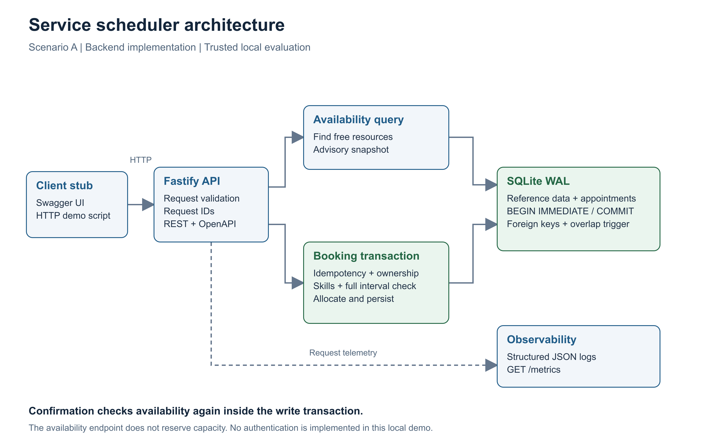
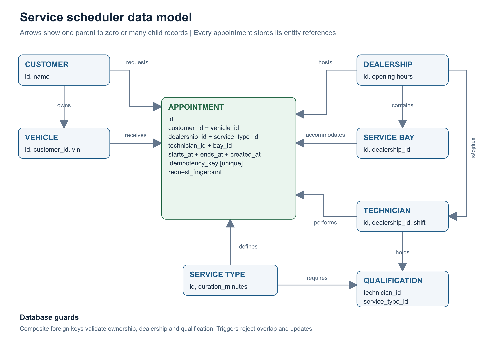

# System design: Unified Service Scheduler

## 1. Goal and architecture

Implement Scenario A's backend: accept a customer/vehicle/service/dealership/time
request, find both resources for the complete duration, and persist a confirmation.
See [requirements](requirements.md) for assumptions and the acceptance plan.

All diagrams in this document are embedded PNG images. Open the files in
`docs/images/` directly for presentations; editable SVG versions are included
alongside them. No diagram rendering plugin is needed to read this document.

| Component | Responsibility |
| --- | --- |
| `app.ts`, `contracts.ts` | HTTP contract, runtime validation, OpenAPI, consistent errors and request telemetry |
| `availability.ts` | UTC time windows, dealership hours, skills, shifts and overlap lookup |
| `scheduler.ts` | Customer/vehicle integrity, deterministic allocation, transactional persistence and replay |
| `database.ts`, `schema.ts` | Connection configuration, versioned schema, relational and overlap constraints |
| `fixtures.ts`, `seed.ts` | Explicit repeatable fictional reference data |
| `scripts/demo.ts` | Client-layer stub and real HTTP demonstration |

One modular service keeps the consistency boundary local. No queue, distributed
lock, microservice or external platform is needed for this assessment.

## 2. Data model

Appointments store all entity references, UTC start/end/creation epoch milliseconds,
a unique idempotency key and a canonical request hash. Response serialization exposes
only the public fields. Duration is derived from the service type and snapshotted in
start/end, so historical intervals survive future catalog duration changes.

Composite foreign keys enforce the customer's vehicle ownership, resource dealership
and technician qualification. `CHECK` constraints validate durations and schedule
ranges. Indexes cover resource/time lookups. An insert trigger rejects resource or
vehicle overlap even if a writer bypasses the scheduler. Updates are rejected because
confirmed appointments are immutable in this scope. Administrative direct deletes
are not a supported API; database access remains privileged.

## 3. Data flow and concurrency

1. Fastify validates size, shape, IDs, UTC format and the idempotency header.
2. The scheduler canonicalizes the request and begins an **immediate transaction**,
   acquiring SQLite's writer lock before checking any mutable booking state.
3. If the key exists, return the original record for the same request or a conflict
   for changed input. Replays work even after the appointment time has passed.
4. Validate future horizon, opening hours, service duration and customer/vehicle.
5. Reject overlapping appointments for the vehicle across all dealerships.
6. Find a bay and qualified technician at the selected dealer whose full interval
   is free and inside the technician's shift. Choose the first IDs deterministically.
7. Insert and commit the appointment with its idempotency data. Only after commit
   does the HTTP handler send `201 Created`. On error, rollback the entire operation.

Two intervals overlap exactly when `existing.start < requested.end` **and**
`existing.end > requested.start`. This covers partial overlaps and containment;
adjacent intervals do not overlap. No booking can combine a bay available only for
the first half with a technician available only for the second half.

SQLite permits one writer at a time. A competing process waits for the writer lock,
then reads the committed state and either chooses another pair, replays the same
request, or reports a conflict. After three seconds of lock contention the API returns
`503` with retry guidance. Synchronous database calls also block this Node process
while waiting: this is an explicit throughput/latency tradeoff, not a horizontal
scaling claim. A barrier-based test exercises separate worker connections.

`GET /availability` does not take a write lock or reserve capacity. Its bay and
technician reads are advisory and may see different commits; `POST /appointments`
is the authority. There is no cache on the booking path.

## 4. Technology choices

| Choice | Reason and tradeoff |
| --- | --- |
| TypeScript, strict mode | Compile-time contracts and straightforward maintainability; runtime validation remains necessary |
| Fastify + TypeBox | Small REST layer; one schema drives validation and generated API docs |
| SQLite + better-sqlite3 | Real persistent ACID database, minimal reviewer setup, direct transactions; one local writer and native module dependency |
| Node test runner + tsx | Business/API tests without a second test framework; workers run the compiled service |
| GitHub Actions template | Prepared typecheck, build and tests on Node 22/24; activation requires workflow-write permission |

Official references: [Fastify validation](https://fastify.dev/docs/latest/Reference/Validation-and-Serialization/),
[SQLite transactions](https://www.sqlite.org/lang_transaction.html),
[SQLite WAL](https://www.sqlite.org/wal.html).

## 5. Reliability, scalability and security

**Implemented:** WAL, full synchronous commits, foreign keys, transactional schema
installation, persisted idempotency, overlap protection, bounded lock timeout,
graceful shutdown, small request body limit, no request-body logging and loopback
binding. Read-by-ID is bounded; reference data is intentionally small and seeded.

**Limits:** one host/local filesystem; unbounded appointment/key history; synchronous
SQL blocks the event loop; deterministic allocation can favor a technician; no
holiday calendar, cancellations, customer authentication or multi-tenant permissions.
Health proves queryability, not a successful future disk write. Metrics reset on restart.

**Production evolution, triggered by measured need:**

1. Add OIDC authentication, explicit dealership-scoped authorization on every query,
   caller-scoped idempotency keys, rate limiting and access auditing. Ownership IDs
   in a JSON request are not identity proof. Limit catalog data and add pagination.
2. Move to PostgreSQL before adding multiple service hosts. Preserve atomic booking
   and add exclusion constraints over time ranges for each resource (including
   vehicle); retry allocation on conflicts. A plain read-then-insert in PostgreSQL
   would lose the current serialization guarantee. Version the schema and prove
   concurrency again during migration.
3. Store real dealership time zones, dated technician shifts, breaks and closures.
   Convert instants at the boundary and test DST changes explicitly.
4. Add allocation fairness when staffing requires it; avoid claiming the current
   lowest-ID selection optimizes utilization or balancing.
5. Add backups with restore drills and monitored disk space. Use SQLite backup APIs
   or a stopped service snapshot, including WAL state. A future database migration
   should use expand/contract changes and a tested rollback/restore plan.
6. If notifications become required, publish from a transactional outbox after
   commit. External calls never belong inside the allocation transaction.

Measure booking p95 latency, resource conflict rates and database busy responses
before choosing capacity thresholds. No load benchmark or production SLA is claimed.

## 6. Observability strategy

**Implemented:** server-generated request IDs are returned in `X-Request-Id` and
errors. JSON logs include route template, status, elapsed time, error code and booking
ID/replay status; request bodies, raw query URLs and idempotency keys are not logged.
`/metrics` exposes counts and total duration by bounded route/status labels. Unknown
paths share `unmatched`; raw IDs cannot create new labels. Restrict this endpoint to
an internal network in production.

**Planned:** a request-duration histogram for p95/p99, booking outcome counters by
reason, lock wait duration, disk/backup signals and OpenTelemetry spans for request,
allocation and commit. Alert on sustained 5xx/503 increases and failed backups;
capacity conflicts are business outcomes and should be tracked separately from
service outages. Tracing is not implemented in this local monolith; request IDs
provide its current correlation mechanism.

## 7. GenAI assistance during design

Codex read the assessment, proposed Scenario A, mapped its acceptance criteria to
code/tests and drafted this design before implementation. Its guidance was to keep
the full-interval allocation invariant central, explicitly state ambiguous working
hours and ownership assumptions, and select a database that reviewers can run locally.

Verification challenged the design rather than relying on generated prose: independent
writers test serialization, interval tests cover containment and exact boundaries,
restart tests reopen persisted state, and contract tests call the actual Fastify
routes. A specialist review pass is documented with its results in
[verification](verification.md). The candidate should review these tradeoffs, adapt
the AI narrative and be prepared to explain the SQL transaction during the interview.
